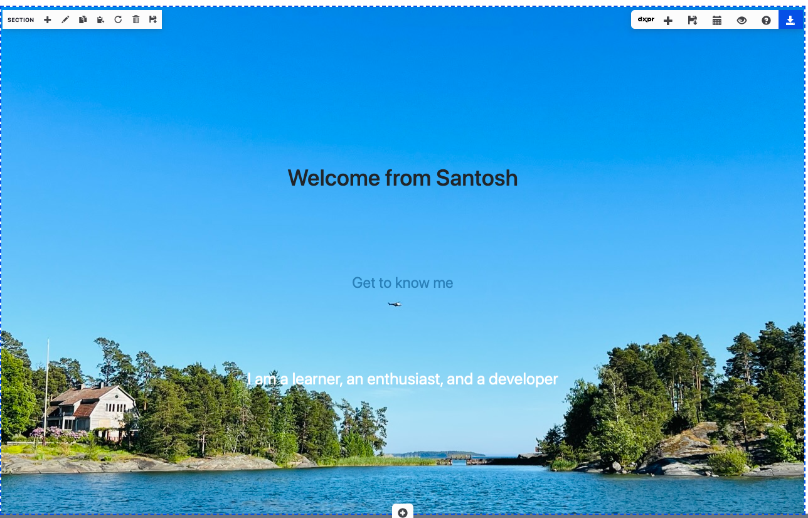
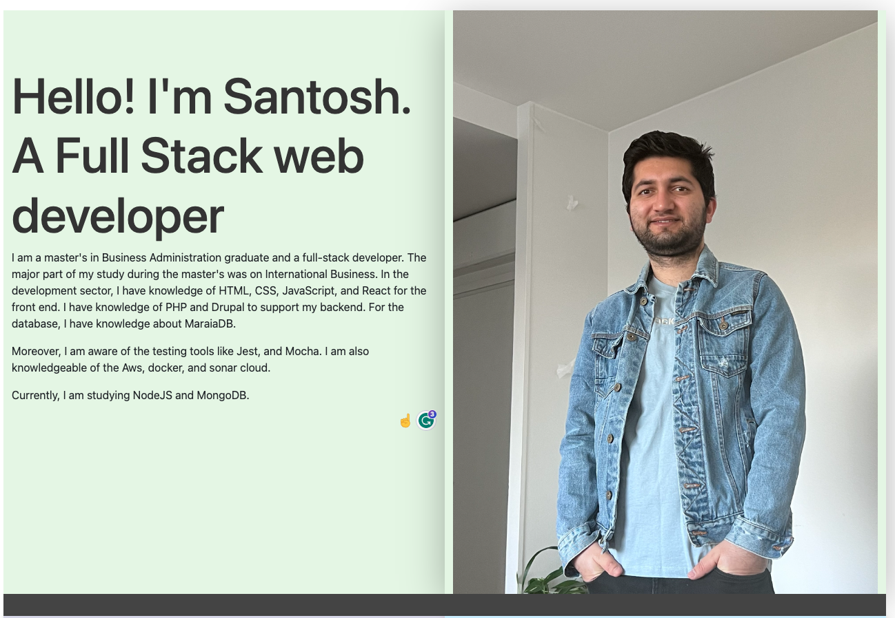
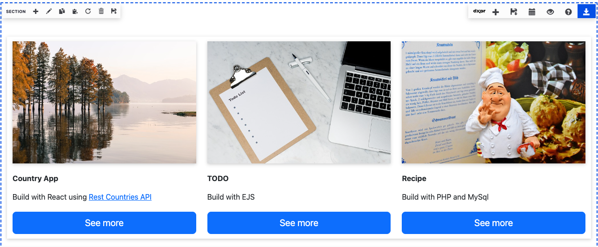
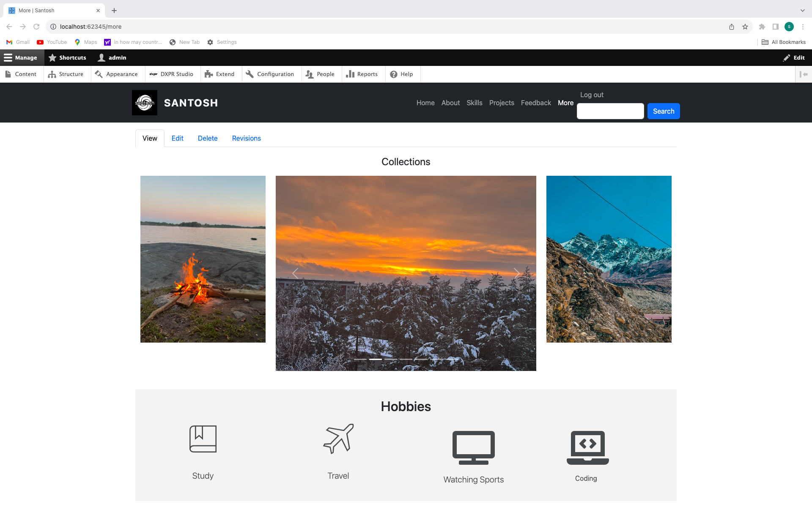

# Portfolio

## Build with
- Drupal 10
```
Lando for installation of drupal
```

## Screenshots





### About the App
- Header with navigating link
- Personal portfolio application.
- Home page with hero banner and welcome text.
- About page with basic introduction and social links
- Skills page to show the skill related to tech stack
- Projects page that shows the few projects and link that navaigates to the github repository of that project
- Contact page with basic contact form
- More page to show hobbies and some images.
- Footer with some message and link to send message

### More info
- Use bootstrap theme for the application
- Use dxpr builder to make the content and user readymade template provided by dxpr.
- Use webfrom module for the form submission
